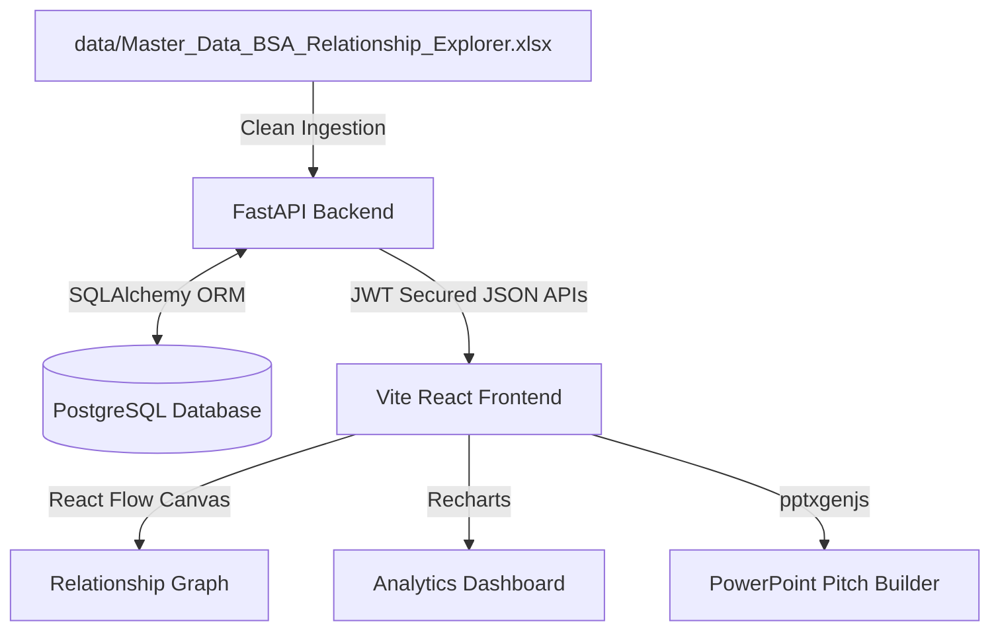

# Capability Explorer (BSA Relationship Explorer V3)

> Turn past project rows into connected strategy intelligence.

**Capability Explorer** is a production-grade internal intelligence platform designed for business strategy, sales pitch preparation, and organizational credential discovery. It parses tabular case results from Microsoft Excel (`data/Master_Data_BSA_Relationship_Explorer.xlsx`) into a normalized relational schema and models them into an interactive knowledge graph network.

---

## 1. System Architecture

The application is built as a decoupled full-stack architecture:



### Technology Stack
* **Frontend**: React (Vite, TypeScript, TailwindCSS v4)
* **Graph Canvas**: React Flow v12 (`@xyflow/react`)
* **Analytics**: Recharts
* **State Management**: Zustand
* **Backend**: FastAPI (Python 3.11+)
* **ORM & Migrations**: SQLAlchemy & Alembic
* **Database**: PostgreSQL (UUID Primary Keys, indexed foreign keys)

---

## 2. Core Features

1. **SaaS-Style Landing Page**: Metric summaries (total project, client, market counts) and quick navigation cards.
2. **Global Command Palette (`CMD+K`)**: Linear-inspired dialog autocomplete matching searching and routing.
3. **Executive Dashboard**: Aggregate charts and distributions for top clients, category frequencies, region coverage, and KPI usage.
4. **Project Explorer**: Full spreadsheet ledger containing multi-select persistent filters (URL state synchronized) and sorting.
5. **Relationship Explorer**: Fully interactive visual knowledge graph. Node categories colored and iconified. Supports progressive neighbor expansion on double click to handle large graphs.
6. **Entity Intelligence Profiles**: Dedicated dashboards at `/entity/:type/:id` summarizing specific client, brand, market, category, or KPI capabilities, showing mini-graph previews and overlap recommendations.
7. **Capability Matrix**: heatmaps (Market × Category, Category × KPI, Market × KPI) showing project count, coverage, and expertise scores.
8. **Credential Finder**: Input Category, Market, and KPI targets to retrieve matched projects ranked by weighting logic (Category 50%, Market 30%, KPI 20%) alongside checklist reasoning justifications.
9. **Why Us Summary**: Dynamic text summaries of experience, printable PDF layout styles, and widescreen client-side PowerPoint slide generators.

---

## 3. Database Schema

The Excel rows are normalized into 6 tables:
* **`clients`**: Unique organizations.
* **`brands`**: Brands modeled in the studies.
* **`categories`**: Standard industry segments (casing normalized).
* **`markets`**: Geographic countries/regions (typos like `GEMANY` -> `Germany` corrected).
* **`kpis`**: Performance dependent variables (KPIs).
* **`projects`**: Central ledger mapping job numbers to dimension UUIDs.

---

## 4. Quick Start & Installation

### Default Authentication Credentials
* **Username**: `admin`
* **Password**: `admin123`

---

### Option A: Local Run (Step-by-Step)

#### Prerequisites
* Python 3.11+
* Node.js 18+
* PostgreSQL server running locally on port 5432.

#### 1. Setup & Ingest Database (Backend)
```bash
cd backend
# Create virtual environment
python3 -m venv venv
source venv/bin/activate

# Install requirements
pip install -r requirements.txt

# Run seed script (drops tables, recreates, and cleans Excel row entries)
python seed.py

# Initialize and stamp Alembic HEAD
alembic stamp head

# Start FastAPI server
uvicorn app.main:app --port 8000 --reload
```
API Documentation will be available at `http://localhost:8000/docs`.

#### 2. Install & Start Web Dashboard (Frontend)
```bash
cd frontend
# Install packages
npm install

# Start Vite React server (automatically proxies /api requests to port 8000)
npm run dev
```
Open your browser to `http://localhost:5173`.

---

### Option B: Docker Compose Run

Spin up a PostgreSQL container and the FastAPI app in one command:
```bash
docker-compose up --build
```
This runs the database and API server at `http://localhost:8000`. To populate/seed the docker postgres database, run:
```bash
docker exec -it ce_fastapi_backend python seed.py
```
